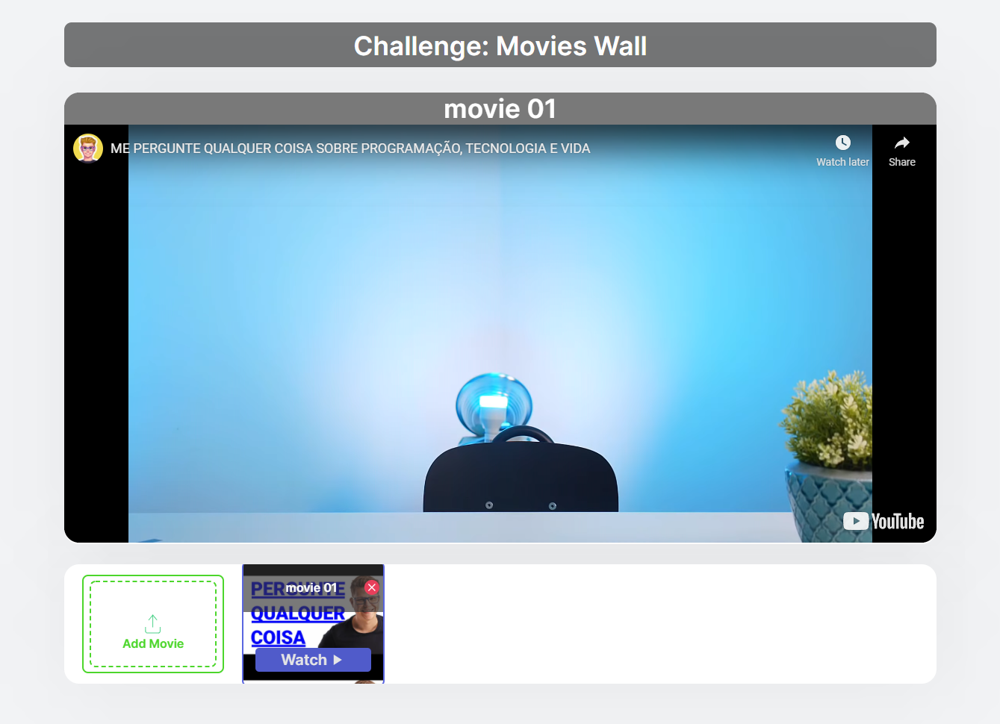

<h1 align="center">
    <strong>Movie Wall</strong>
</h1>

  <a href="#-tecnologias">Tecnologias</a>&nbsp;&nbsp;&nbsp;|&nbsp;&nbsp;&nbsp;
  <a href="#-projeto">Projeto</a>&nbsp;&nbsp;&nbsp;|&nbsp;&nbsp;&nbsp;
  <a href="#-layout">Layout</a>&nbsp;&nbsp;&nbsp;|&nbsp;&nbsp;&nbsp;
  <a href="#-como-executar">Como executar</a>&nbsp;&nbsp;&nbsp;|&nbsp;&nbsp;&nbsp;

 

    <apan align="center">
      
    </apan>
    
      
    

## Deploy
- [Vercel](https://move-it-psi-sepia.vercel.app/) - https://move-it-psi-sepia.vercel.app/

## ✨ Tecnologias

Esse projeto foi desenvolvido com as seguintes tecnologias:

- [React](https://reactjs.org)
- [Next.js](https://nextjs.org/)
- [TypeScript](https://www.typescriptlang.org/)

## 💻 Projeto

Esse projeto e o desafio proposto pela Include.jr para seleção de novos menbros, no qual o participante tem que desenvolver um sistema web  com seguinte funcionalidade, adicionar um video qualquel do youtube e depois poder assistir.

## 🔖 Layout

Você pode visualizar o layout do projeto através [desse link](https://www.figma.com/file/rDGZnUCdXp0A6W41Ns6vbD/Movies-Wall?node-id=8:1). É necessário ter conta no [Figma](http://figma.com/) para acessá-lo.

## 🚀 Como executar

- Clone o repositório
- Instale as dependências com `yarn`
- Inicie o servidor com `yarn dev`

Agora você pode acessar [`localhost:3000`](http://localhost:3000) do seu navegador.